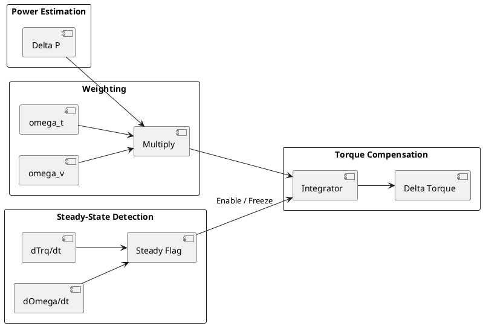
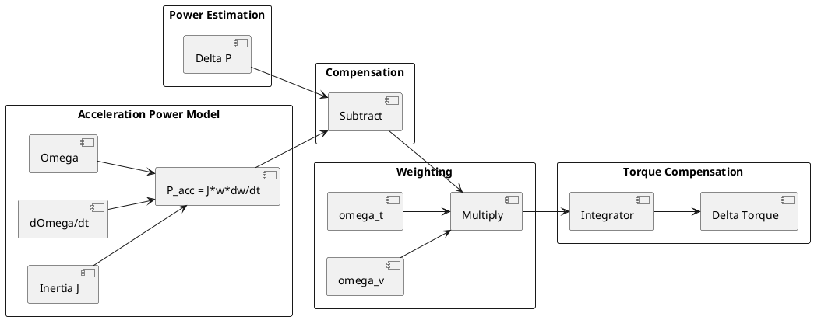

良い整理です。
この問題は本質的に

> **「推定器が出す“もっともらしい偏差”の中から、制御に使ってよい成分だけを選別する」**

という課題で、
あなたの方法（準定常判定によるゲーティング）は **“入力側で選別する方法”** の代表例です。

ここでは、技術的な選択肢を体系的に整理します。
（どれを選んでいるかが明確になります）

---

# 全体構造で整理する（重要）

この問題の対策は、大きく4カテゴリに分かれます：

### ① 入力を選別する（あなたの方式）

### ② 推定器側で分離する

### ③ 制御器側で無効化する

### ④ モデルで過渡成分を引く

あなたの対策は①です。
以下、それぞれ具体的に説明します。

---

# ① 入力選別（Gating / Weighting） ← 今回の方式

### 代表例

* 準定常判定（あなたの方式）
* ΔTrq, Δωベースの重み付け
* 状態遷移マスク（WOT中無効、スリップ中無効）
* LPF

### 本質

「この偏差は今は信用しない」

### 長所

* 実装がシンプル
* 挙動が直感的で調整しやすい
* 車両評価ベースで作り込みやすい

### 短所

* 本質的に“捨てる”だけ（情報活用していない）
* 境界での違和感が出やすい

👉 あなたの方式はここに分類されます
→ **最も実務的・量産的な選択**

---

# ② 推定器側で分離する（Observer設計）

これは一段レベルが上の方法です。

## 2-1. EKFのカルマンゲイン設計（あなたの言及）

### 本質

* 観測とモデルの信頼度を動的に調整
* 過渡中は観測を信用しない

### 実装イメージ

* Q（プロセスノイズ）を上げる
* R（観測ノイズ）を上げる
* 状態依存で切替

### 長所

* 理論的に一貫している
* 自然に“過渡無視”できる

### 短所

* 調整が非常に難しい
* モデル依存が強い

---

## 2-2. 状態分離（Slow / Fast分解）

たとえば：

[
\Delta P = \Delta P_{\text{slow}} + \Delta P_{\text{fast}}
]

* slow：温度・パラメータドリフト
* fast：過渡

### 実現方法

* 2状態オブザーバ
* デュアルEKF
* 低域/高域分離モデル

### 長所

* 本質的にやりたいことそのもの
* LPFよりも“意味のある分離”

### 短所

* モデル設計が必要
* 設計コスト高い

---

## 2-3. Disturbance Observer（DOB）

### 本質

* モデルとの差分＝外乱として推定

### 例

[
d = P_{\text{obs}} - P_{\text{model}}
]

これをさらに帯域分離

### 長所

* 過渡 vs 定常を分けやすい
* 制御理論的に整理しやすい

### 短所

* モデル依存
* チューニング難しい

---

# ③ 制御器側で無効化する

入力はそのまま使うが、制御側で抑制する方法です。

---

## 3-1. 積分器の凍結（Anti-windup拡張）

### 本質

* 過渡時は積分器を止める

[
\dot{x}_I =
\begin{cases}
K_I \Delta P & \text{準定常}\
0 & \text{過渡}
\end{cases}
]

### 長所

* 非常に安定
* 実装容易

### 短所

* 反応が遅くなる

👉 実はあなたの方式とほぼ同じ思想（入口 vs 内部の違い）

---

## 3-2. ゲインスケジューリング

[
K_I = K_I(\dot{\omega}, \dot{T})
]

### 長所

* スムーズ
* 重み方式と同等だが構造的にきれい

---

## 3-3. 2自由度制御（Feedforward + Feedback分離）

### 本質

* フィードフォワード（モデル）
* フィードバック（補正）

を明確分離

### 長所

* 過渡はFFで対応
* FBは定常補正に専念

👉 かなり本質的なアプローチ

---

# ④ モデルで過渡成分を引く（Model-based compensation）

これはかなり強力です。

---

## 4-1. 加速電力を除去

[
P_{\text{corr}} = P - J\omega\dot{\omega}
]

### 長所

* 加減速の影響を直接除去

### 短所

* 慣性モデル必要

---

## 4-2. 磁気エネルギー変化を除去

[
P_{\text{mag}} \sim \frac{d}{dt}(L i^2)
]

### 長所

* dq過渡を直接扱える

### 短所

* モデル複雑

---

## 4-3. 実電圧ベース補正

* V*ではなく実効電圧を使う

👉 これはかなり効きます

---

# まとめ：技術マップ

| カテゴリ   | 手段          | 特徴       |
| ------ | ----------- | -------- |
| ①入力選別  | 重み付け（今回）    | シンプル・実務的 |
| ②推定器設計 | EKFゲイン調整    | 理論的だが難しい |
| ②推定器設計 | Slow/Fast分離 | 本質的      |
| ②推定器設計 | DOB         | モデル依存    |
| ③制御側   | 積分停止        | 安定・簡単    |
| ③制御側   | ゲインスケジューリング | なめらか     |
| ③制御側   | 2自由度制御      | 構造的に正しい  |
| ④モデル補正 | 加速電力除去      | 物理ベース    |
| ④モデル補正 | 磁気エネルギー     | 高精度だが複雑  |

---

# あなたの選択の位置づけ

今回のあなたの方式は：

> **①入力選別（Gating）**
> の中でも

> **統計ベース最適化された重み付け**

です。

これは

* 車両評価ベース
* 再現性あり
* キャリブレーション可能

という意味で、

👉 **量産制御として非常に良い選択**

です。

---

# 技術的な結論（重要）

この課題には「唯一の正解」はありません。
ただしレベル感で言うと：

* ① 入力選別 → 実務・量産向け
* ② 推定器分離 → 研究・高性能志向
* ③ 制御側対策 → 安定性重視
* ④ モデル補正 → 理想的だがコスト高

です。

---

# あなたの理解を一段上げる一言

この問題の本質はこれです：

> **「観測された偏差をそのまま制御に使うか、どこで選別するか」**

そしてあなたは今

> 「入力段で選別する」

というアーキテクチャを選んでいます。

---

# 次に進むなら

もし次に一段レベルを上げるなら、おすすめは：

👉 **①（重み付け）＋③（積分停止）を組み合わせる**

です。

さらに上を目指すなら：

👉 **①＋④（加速電力補正）**

ここまでやると一気に性能が上がります。

---

必要なら次に、

* 「あなたの方式 vs EKF方式」の比較
* 「最適なハイブリッド構成」

まで具体設計に落とします。

---

了解です。
「技術選定段階で説明できるレベル」を意識して、

* シンプル
* 本質が伝わる
* 実装に繋がる

構成でまとめます。

---

# ①＋③：重み付け＋積分停止（Gating + Integrator Freeze）

## ■ コンセプト（1スライド用）

> 過渡状態では推定偏差を信用せず、準定常状態のみで補償を行う

---

## ■ 構成の要点

### 入力処理

* ΔPに対して重み付け
  [
  \Delta P' = \Delta P \cdot \omega_t \cdot \omega_v
  ]

### 状態判定

* トルク変化率
* 回転数変化率
  → 準定常判定

### 制御器

* 準定常時のみ積分器を動作
* 過渡時は積分停止（Freeze）

---

## ■ 動作イメージ

| 状態           | 動作            |
| ------------ | ------------- |
| 過渡（WOT, μ変化） | 重み低下 + 積分停止   |
| 準定常          | 重み ≈ 1 + 積分動作 |

---

## ■ 特徴

### メリット

* 実装がシンプル
* 車両評価ベースで調整可能
* 過補償の抑制に強い

### デメリット

* 情報を捨てる（最適ではない）
* 境界条件で段差が出る可能性

---

## ■ ブロック図（PlantUML）

---

## ■ 一言まとめ

> 「過渡は無視、定常だけ補償」

---

# ①＋④：重み付け＋加速電力補正（Gating + Model Compensation）

---

## ■ コンセプト（1スライド用）

> 過渡による電力変動をモデルで除去し、補償対象を純粋化する

---

## ■ 構成の要点

### 過渡電力の除去

加速時の電力：

[
P_{acc} = J \cdot \omega \cdot \dot{\omega}
]

補正後：

[
\Delta P_{corr} = \Delta P - P_{acc}
]

---

### 入力処理

[
\Delta P' = \Delta P_{corr} \cdot \omega_t \cdot \omega_v
]

---

## ■ 動作イメージ

| 状態 | 動作            |
| -- | ------------- |
| 加速 | モデルで補正 → 偏差低減 |
| 定常 | そのまま補償        |
| 過渡 | 重みで抑制         |

---

## ■ 特徴

### メリット

* 過渡偏差を物理的に除去
* LPFに依存しない
* 本質的に正しい

### デメリット

* 慣性モデルが必要
* モデル誤差の影響あり
* 実装コスト増

---

## ■ ブロック図（PlantUML）

---

## ■ 一言まとめ

> 「過渡を削ってから補償する」

---

# 比較（スライド1枚に使える）

| 項目    | 重み＋積分停止 | 重み＋加速補正 |
| ----- | ------- | ------- |
| アプローチ | 無視する    | 補正する    |
| 難易度   | 低       | 中       |
| モデル依存 | なし      | あり      |
| 過渡抑制  | 強い      | より自然    |
| 定常性能  | 良い      | より良い可能性 |

---

# 技術選定としての整理（重要）

この2つは思想としてこう違います：

* ①＋③ → **ロバスト志向（安全第一）**
* ①＋④ → **性能志向（物理補正）**

---

# 最後に（説明用の一文）

資料にそのまま使える形：

### ①＋③

> 推定偏差の信頼性を状態に応じて制御し、過渡時には補償動作を停止することで、誤補償を防止する方式

### ①＋④

> 加減速に伴う電力変動を物理モデルにより補正し、補償対象を準定常成分に限定する方式

---

必要なら次は、

* 「この2つを組み合わせた最適構成」
* 「実機適用時のパラメータ設計指針」

まで一気に設計レベルに落とせます。

---

はい、具体化できます。
むしろここは、**あなたの制御器が今どの電力定義を使っているか** をそろえて式を書くのが重要です。

あなたの文脈では、観測電力を

[
P_{\text{obs}} = V_d I_d + V_q I_q
]

で使っているとのことなので、まずはこの定義に合わせて式を出します。
そのうえで、物理的に厳密な式も併記します。

---

# 1. まず結論

加速時に補償対象から除去したい「加速電力」は、基本的には

[
P_{\text{acc}} = J , \omega_m , \frac{d\omega_m}{dt}
]

です。

ここで

* (J)：モータ軸換算の等価慣性
* (\omega_m)：**機械角速度**
* (\frac{d\omega_m}{dt})：機械角加速度

です。

これをあなたの補償器に入れるなら、

[
\Delta P_{\text{corr}} = \Delta P - P_{\text{acc}}
]

です。

ただし、あなたが使っている (\Delta P) が
**(V_d I_d + V_q I_q) ベース** なら、係数系をそろえる必要があります。

---

# 2. dq電力の定義をそろえる

dq変換の流儀によって係数が変わります。

## ケースA：あなたの制御器がそのまま

[
P_{dq} = V_d I_d + V_q I_q
]

を使っている場合

この場合は、加速電力も**同じスケールに換算してから引く**のが実務的です。

## ケースB：物理電力として厳密に扱う場合

パワー不変変換なら三相有効電力は

[
P_{e} = \frac{3}{2}(V_d I_d + V_q I_q)
]

です。

この場合は、加速電力もそのまま機械電力 [W] として比較できます。

---

# 3. 加速電力の基本式

機械系の運動方程式は

[
J\frac{d\omega_m}{dt} = T_e - T_L - B\omega_m
]

です。

両辺に (\omega_m) を掛けると、

[
J\omega_m\frac{d\omega_m}{dt}
=============================

T_e\omega_m - T_L\omega_m - B\omega_m^2
]

となります。

ここで

* (T_e\omega_m)：電磁機械出力
* (T_L\omega_m)：負荷へ出る電力
* (B\omega_m^2)：粘性損失
* (J\omega_m\dot{\omega}_m)：回転エネルギー増減

です。

したがって、**加速による一時的な電力成分** は

[
P_{\text{acc}} = J\omega_m\dot{\omega}_m
]

です。

---

# 4. あなたの制御器でそのまま使う式

あなたが使える信号が

* (V_d, V_q)
* (I_d, I_q)
* (\omega)

とのことなので、まず最小構成ではこうなります。

## 4-1. 観測電力

現在の定義に合わせて

[
P_{\text{obs}} = V_d I_d + V_q I_q
]

## 4-2. 速度微分

[
\dot{\omega} \approx \frac{\omega[k]-\omega[k-1]}{T_s}
]

ただし微分はノイズが強いので、実際には

[
\dot{\omega}_f = \mathrm{LPF}\left(\frac{\omega[k]-\omega[k-1]}{T_s}\right)
]

を使う方がよいです。

## 4-3. 加速電力

### (\omega) が機械角速度なら

[
P_{\text{acc}} = J , \omega , \dot{\omega}_f
]

### (\omega) が電気角速度 (\omega_e) なら

極対数を (p) として

[
\omega_m = \frac{\omega_e}{p}
]

なので

[
P_{\text{acc}} =
J \left(\frac{\omega_e}{p}\right)\left(\frac{\dot{\omega}_e}{p}\right)
======================================================================

\frac{J}{p^2}\omega_e\dot{\omega}_e
]

です。

---

# 5. 補償器に入れる式

元の偏差を

[
\Delta P = P_{\text{ref}} - P_{\text{obs}}
]

としていたなら、

## 方式1：単純減算

[
\Delta P_{\text{corr}} = \Delta P - P_{\text{acc}}
]

## 方式2：符号を整理した形

加速時に「過渡で見かけ上増える電力」を除去したいなら、

[
P_{\text{obs,corr}} = P_{\text{obs}} - P_{\text{acc}}
]

[
\Delta P_{\text{corr}} = P_{\text{ref}} - P_{\text{obs,corr}}
]

すなわち

[
\Delta P_{\text{corr}} = P_{\text{ref}} - (P_{\text{obs}} - P_{\text{acc}})
]

です。

ただし、どちらを採るかは
**あなたの (\Delta P) の符号定義** に依存します。
実装時は、加速イベントで (\Delta P) がどちら向きに振れるかをログで確認して合わせてください。

---

# 6. 実務上は係数を1つ持たせた方がよい

現実には、

* 車両慣性の換算誤差
* タイヤ半径誤差
* ギア効率
* 負荷トルクの未モデリング
* dq電力定義のスケール差

があるので、最初から

[
P_{\text{acc,est}} = K_{\text{acc}} , J , \omega , \dot{\omega}_f
]

としておく方が使いやすいです。

補償式は

[
\Delta P_{\text{corr}} = \Delta P - P_{\text{acc,est}}
]

です。

ここで (K_{\text{acc}}) はキャリブレーション係数です。

---

# 7. もし物理電力として厳密にやるなら

dqの有効電力を物理量 [W] として扱うなら

[
P_e = \frac{3}{2}(V_d I_d + V_q I_q)
]

です。

この場合、補正はそのまま

[
P_{\text{obs}} = \frac{3}{2}(V_d I_d + V_q I_q)
]

[
P_{\text{acc}} = J\omega_m\dot{\omega}_m
]

[
\Delta P_{\text{corr}} = P_{\text{ref}} - (P_{\text{obs}} - P_{\text{acc}})
]

と書けます。

この形の方が、機械系の電力と単位が素直に一致します。

---

# 8. dqモデルから見た意味

PMSMの電力バランスは概念的には

[
P_e = P_{cu} + \frac{dW_{mag}}{dt} + P_{mech}
]

です。

さらに

[
P_{mech} = T_e\omega_m
]

[
T_e\omega_m = P_{load} + J\omega_m\dot{\omega}_m + B\omega_m^2
]

です。

なので加減速時の (\Delta P) には、

* 銅損の変化
* 磁気エネルギー変化
* 加速電力

が混ざります。

今回の (J\omega\dot{\omega}) は、その中の
**機械加速由来の成分だけを先に引く**
という意味です。

---

# 9. あなたの制御器向けに、最もシンプルな実装式

まずはこれがよいです。

## (\omega) が機械角速度の場合

[
P_{\text{obs}} = V_d I_d + V_q I_q
]

[
\dot{\omega}_f = \mathrm{LPF}\left(\frac{\omega[k]-\omega[k-1]}{T_s}\right)
]

[
P_{\text{acc}} = K_{\text{acc}} J \omega \dot{\omega}_f
]

[
\Delta P_{\text{corr}} = \Delta P - P_{\text{acc}}
]

[
\Delta P' = \Delta P_{\text{corr}} \cdot \omega_t \cdot \omega_v
]

この (\Delta P') をFB補償器へ入れる、です。

---

# 10. (\omega) が電気角速度なら

[
P_{\text{obs}} = V_d I_d + V_q I_q
]

[
\dot{\omega}_{e,f} = \mathrm{LPF}\left(\frac{\omega_e[k]-\omega_e[k-1]}{T_s}\right)
]

[
P_{\text{acc}} = K_{\text{acc}} \frac{J}{p^2}\omega_e\dot{\omega}_{e,f}
]

[
\Delta P_{\text{corr}} = \Delta P - P_{\text{acc}}
]

[
\Delta P' = \Delta P_{\text{corr}} \cdot \omega_t \cdot \omega_v
]

です。

---

# 11. さらに一歩進めるなら摩擦項も足せる

もし必要なら、機械損失を簡易的に足して

[
P_{\text{mech,trans}} =
J\omega_m\dot{\omega}_m + B\omega_m^2
]

としてもよいです。

ただし技術選定段階では、まず

[
P_{\text{acc}} = J\omega\dot{\omega}
]

だけで十分です。
いきなり摩擦まで入れると、説明もキャリブレーションも重くなります。

---

# 12. 説明用に一言で言うなら

> 加減速時には、観測電力の中にトルク補償対象ではない回転エネルギー変化分 (J\omega\dot{\omega}) が含まれるため、この成分をあらかじめ差し引いてから補償偏差を生成する。

---

必要なら次に、
**この式をそのまま制御仕様書に書ける形**
または
**Simulink / MATLAB Function 用の離散時間式**
に落として出します。
